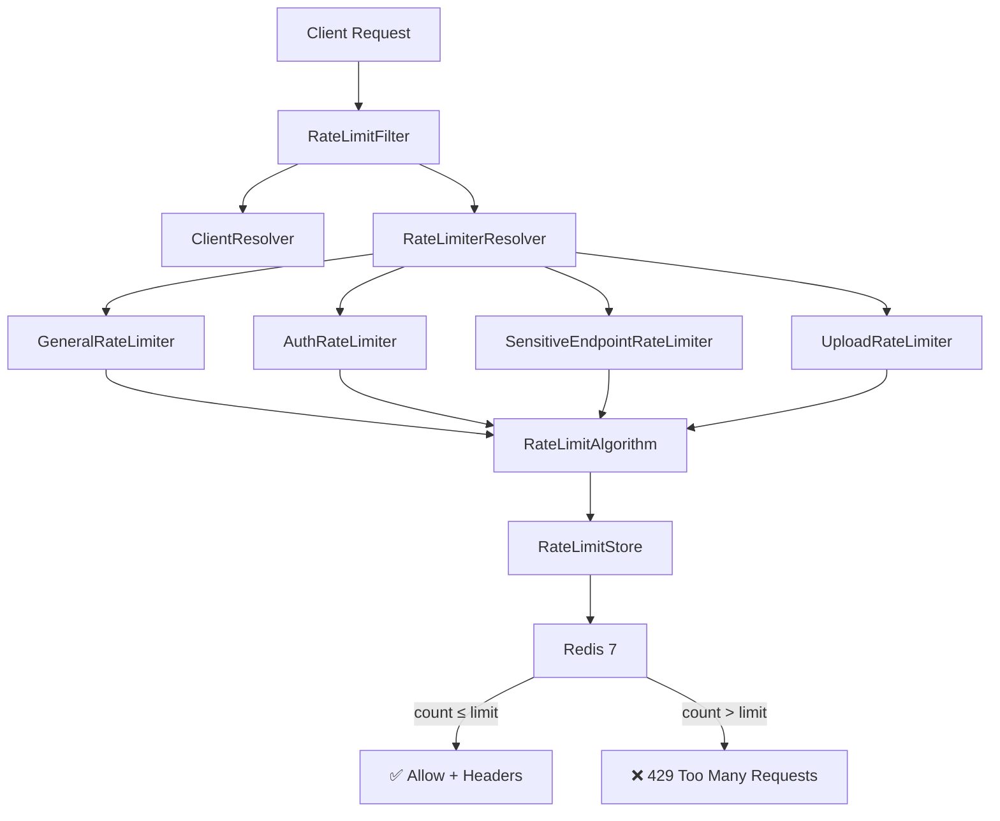

# Spring Boot Redis Rate Limiter

A production-grade, distributed, category-based rate-limiting system built with **Spring Boot 3.2**, **Java 17**, **Redis 7**, and **Lua scripting**.

## Architecture



## Why Redis?

- **Distributed state**: All application instances share the same counters
- **Atomicity**: Lua scripts execute `INCR + EXPIRE` atomically — no race conditions
- **Performance**: Sub-millisecond latency for counter operations
- **TTL**: Automatic window expiration built into Redis

## Rate Limiter Categories

| Category | Route Pattern | Limit | Window | Client Type |
|----------|--------------|-------|--------|-------------|
| **General** | Everything else | 100 req | 60s | IP |
| **Auth** | `/api/auth/**` | 10 req | 60s | IP |
| **Sensitive** | `/api/payment/**`, `/api/admin/**`, `DELETE /api/users/**` | 20 req | 60s | USER |
| **Upload** | `/api/upload/**`, `/api/files/upload/**` | 20 req | 60s | USER |

## Request Flow

```
HTTP Request
    ↓
RateLimitFilter (OncePerRequestFilter)
    ↓
ClientResolver → resolves IP or authenticated user
    ↓
RateLimiterResolver → selects limiter by route pattern
    ↓
AbstractRateLimiter → coordinates policy + algorithm
    ↓
RateLimitPolicy → provides limit, window, algorithm type
    ↓
FixedWindowAlgorithm → delegates to store
    ↓
RedisRateLimitStore → executes Lua script atomically
    ↓
Redis → INCR + conditional EXPIRE
    ↓
RateLimitResult → allowed/rejected with remaining count
    ↓
Response headers (X-RateLimit-*) or 429 + Retry-After
```

## Redis Key Design

Keys follow the pattern: `rl:{category}:{clientType}:{clientId}`

```
rl:general:ip:192.168.1.10
rl:auth:ip:192.168.1.10
rl:sensitive:user:123
rl:upload:user:456
```

**Security**: JWTs, passwords, API keys, and authorization headers are never stored in Redis keys.

## Fixed Window Algorithm

The Lua script (`fixed-window.lua`) executes atomically:

```lua
local key = KEYS[1]
local window = tonumber(ARGV[1])
local current = redis.call('INCR', key)
if current == 1 then
    redis.call('EXPIRE', key, window)
end
return current
```

1. **INCR** the counter (creates key with value 1 if new)
2. **EXPIRE** only on first request (when `current == 1`)
3. Returns the current count for Java to compare against the limit

This guarantees no race conditions between increment and expiration.

## Configuration

All limits are configurable via `application.yml`:

```yaml
rate-limiter:
  enabled: true
  fail-mode: OPEN  # OPEN = allow on Redis failure, CLOSED = reject
  general:
    limit: 100
    window: 60s
    algorithm: FIXED_WINDOW
    client-type: IP
  auth:
    limit: 10
    window: 60s
    algorithm: FIXED_WINDOW
    client-type: IP
  sensitive:
    limit: 20
    window: 60s
    algorithm: FIXED_WINDOW
    client-type: USER
  upload:
    limit: 20
    window: 60s
    algorithm: FIXED_WINDOW
    client-type: USER
```

## Failure Modes

| Mode | Behavior on Redis failure |
|------|--------------------------|
| `OPEN` | Allow the request (log the error) |
| `CLOSED` | Reject with 429 (log the error) |

## Quick Start

### Prerequisites
- Java 17+
- Maven 3.8+
- Docker & Docker Compose

### Run with Docker Compose

```bash
# Start Redis only
docker-compose up -d redis

# Run the app locally
mvn spring-boot:run

# OR run everything in Docker
docker-compose up --build
```

### API Examples

```bash
# General endpoint (100 req/min)
curl http://localhost:8080/api/test

# Auth endpoint (10 req/min)
curl -X POST http://localhost:8080/api/auth/login

# Upload endpoint (20 req/min)
curl -X POST http://localhost:8080/api/upload

# Sensitive endpoint (20 req/min)
curl -X POST http://localhost:8080/api/payment
```

### Successful Response Headers

```http
HTTP/1.1 200 OK
X-RateLimit-Limit: 100
X-RateLimit-Remaining: 72
X-RateLimit-Reset: 43
```

### Rate Limited Response

```http
HTTP/1.1 429 Too Many Requests
Retry-After: 43
Content-Type: application/json

{
  "status": 429,
  "error": "Too Many Requests",
  "message": "Rate limit exceeded",
  "retryAfterSeconds": 43
}
```

## Testing

```bash
# Run all tests (unit + integration with Testcontainers)
mvn test

# Tests include:
# - ClientResolver: anonymous, authenticated, blank/null principal
# - RateLimiterResolver: all route categories
# - FixedWindowAlgorithm: under/at/over limit, TTL handling
# - PolicyConfiguration: all 4 policies
# - RateLimitFilter: allowed, rejected, disabled, fail-open, fail-closed
# - RateLimitKeyBuilder: all key formats
# - Redis Integration: 100+1 requests, independent clients
# - Concurrency: 200 concurrent requests, exactly 100 allowed
```

## Observability

Metrics exposed via Micrometer at `/actuator/metrics`:

```
rate_limit_requests_total{category="general"}
rate_limit_allowed_total{category="auth"}
rate_limit_rejected_total{category="upload"}
rate_limit_redis_errors_total
```

Health check: `GET /actuator/health`

## Project Structure

```
src/main/java/com/example/ratelimiter/
├── RateLimiterApplication.java       # Entry point
├── config/                           # Configuration & enums
│   ├── RateLimiterProperties.java    # @ConfigurationProperties
│   ├── RedisConfig.java              # Redis template + Lua script beans
│   ├── RateLimitAlgorithmType.java   # FIXED_WINDOW, SLIDING_WINDOW, TOKEN_BUCKET
│   ├── ClientType.java               # IP, USER
│   └── FailMode.java                 # OPEN, CLOSED
├── filter/
│   └── RateLimitFilter.java          # OncePerRequestFilter orchestrator
├── resolver/
│   ├── RateLimiterResolver.java      # Interface
│   └── DefaultRateLimiterResolver.java # Route → category mapping
├── limiter/
│   ├── RateLimiter.java              # Interface
│   ├── AbstractRateLimiter.java      # Template method (shared logic)
│   ├── RateLimitKeyBuilder.java      # Redis key construction
│   ├── GeneralRateLimiter.java
│   ├── AuthRateLimiter.java
│   ├── SensitiveEndpointRateLimiter.java
│   └── UploadRateLimiter.java
├── policy/
│   ├── RateLimitPolicy.java          # Interface
│   ├── GeneralPolicy.java
│   ├── AuthPolicy.java
│   ├── SensitivePolicy.java
│   └── UploadPolicy.java
├── algorithm/
│   ├── RateLimitAlgorithm.java       # Strategy interface
│   ├── AlgorithmResolver.java        # Type → implementation
│   ├── FixedWindowAlgorithm.java     # ✅ Fully implemented
│   ├── SlidingWindowAlgorithm.java   # 🚧 Throws UnsupportedOperationException
│   └── TokenBucketAlgorithm.java     # 🚧 Throws UnsupportedOperationException
├── store/
│   ├── RateLimitStore.java           # Interface
│   └── RedisRateLimitStore.java      # Only class talking to Redis
├── client/
│   ├── ClientResolver.java           # Interface
│   ├── DefaultClientResolver.java    # IP / authenticated user resolution
│   └── ClientContext.java            # Immutable record
├── dto/
│   ├── RateLimitResult.java          # Immutable result record
│   └── RateLimitErrorResponse.java   # 429 JSON body
├── exception/
│   └── RateLimitExceededException.java
└── controller/
    └── DemoController.java           # Test endpoints only
```

## Future: Sliding Window & Token Bucket

The architecture is designed so changing `algorithm: FIXED_WINDOW` to `algorithm: SLIDING_WINDOW` requires **zero changes** to:
- Filter, Resolver, Limiter, Controller, or Policy classes

Only the algorithm implementation and its Lua script need to be completed:

```
AlgorithmResolver
    ├── FixedWindowAlgorithm  ← ✅ Done
    ├── SlidingWindowAlgorithm ← TODO: Redis sorted set + sliding-window.lua
    └── TokenBucketAlgorithm   ← TODO: Redis hash + token-bucket.lua
```

### Sliding Window Plan
- Use Redis ZSET, scored by timestamp
- Remove entries older than `now - window`
- Count remaining; if under limit, add and allow

### Token Bucket Plan
- Use Redis hash storing `tokens` and `last_refill`
- Calculate refill based on elapsed time
- Consume one token per request; reject when empty
