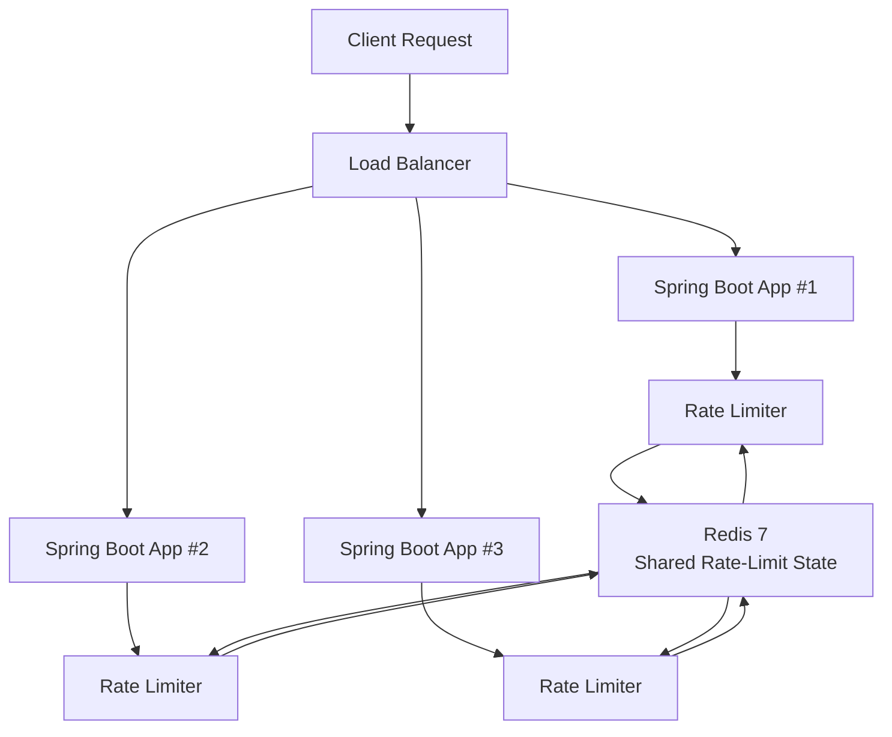
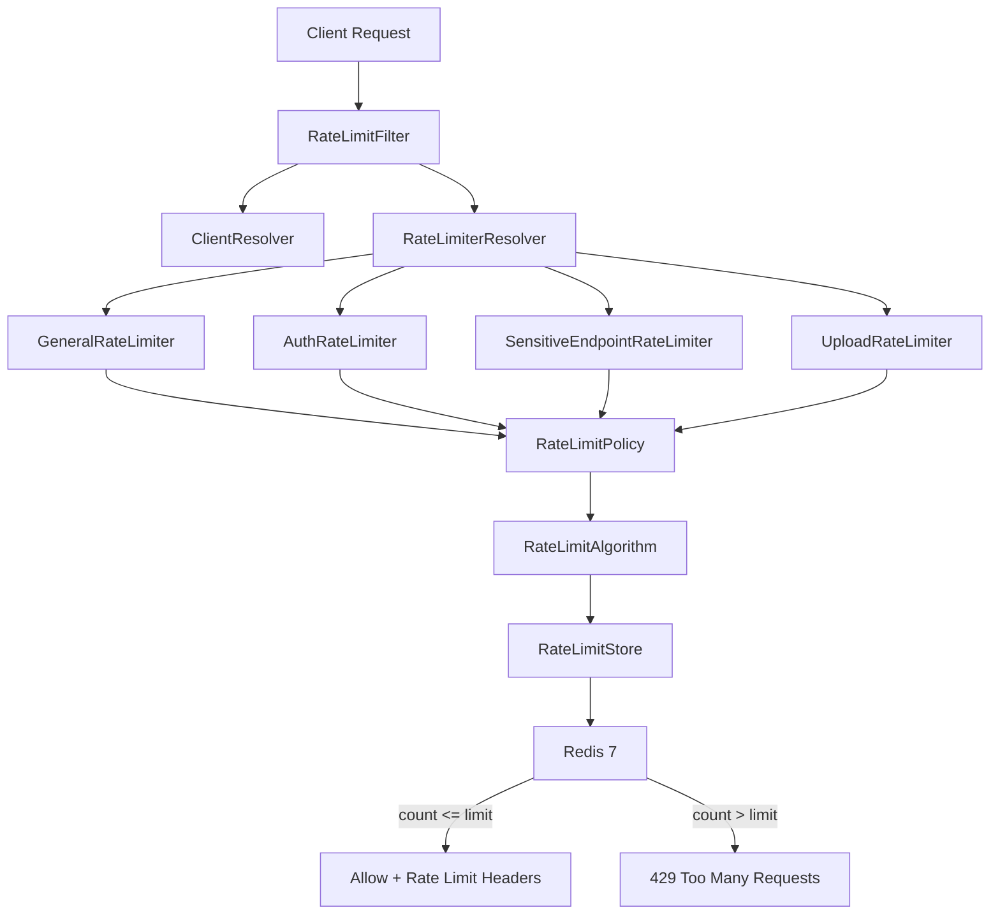

# Spring Boot Distributed Redis Rate Limiter


> [!TIP]
> This is a public template. You’re free to use it for your project.


A production-grade, distributed, category-based rate-limiting system built with **Spring Boot 3.2**, **Java 17**, **Redis 7**, and **Lua scripting**.

## Architecture

The rate limiter is designed to work across multiple Spring Boot application instances behind a load balancer.



### How Distribution Works

Multiple Spring Boot instances can run behind a load balancer:

```text
Client
   │
   ▼
Load Balancer
   │
   ├──────► App #1
   │
   ├──────► App #2
   │
   └──────► App #3
              │
              ▼
        Shared Redis
```

Each application instance runs its own rate-limiter code, but **rate-limit state is stored centrally in Redis**.

For example, assume the limit is **100 requests per 60 seconds** for an IP:

```text
App #1 ──┐
App #2 ──┼──► Redis
App #3 ──┘
```

If the same client sends:

```text
App #1 → 40 requests
App #2 → 35 requests
App #3 → 25 requests
```

Redis maintains the shared counter:

```text
Total = 100 requests
```

The next request increments the Redis counter to `101` and is rejected with `429 Too Many Requests`.

This prevents each application instance from maintaining an independent counter.

### Why This Is Distributed

The rate limiter is distributed because:

* Multiple Spring Boot instances can run simultaneously.
* All instances use the same Redis-backed rate-limit state.
* Requests can be routed to any application instance by the load balancer.
* Redis provides atomic counter operations through Lua scripts.
* Rate limits remain consistent across application instances.

Without shared Redis state, each application instance could maintain its own counter:

```text
App #1 → 100 requests
App #2 → 100 requests
App #3 → 100 requests

Potential total = 300 requests
```

With Redis:

```text
App #1 ──┐
App #2 ──┼──► Shared Redis Counter = 100
App #3 ──┘

Next request → 101 → 429
```

> [!IMPORTANT]
> Redis is the shared state layer that makes the rate limiter distributed. The Spring Boot instances remain stateless with respect to rate-limit counters.

## Internal Architecture



## Why Redis?

* **Distributed state**: All application instances share the same counters.
* **Atomicity**: Lua scripts execute `INCR + EXPIRE` atomically.
* **Low latency**: Redis provides low-latency counter operations.
* **TTL**: Automatic window expiration is handled by Redis.
* **Scalability**: Multiple application instances can share the same rate-limit state.
* **Centralized state**: Rate-limit counters are independent of individual JVM instances.

## Rate Limiter Categories

| Category      | Route Pattern                                              |   Limit | Window | Client Type |
| ------------- | ---------------------------------------------------------- | ------: | -----: | ----------- |
| **General**   | Everything else                                            | 100 req |    60s | IP          |
| **Auth**      | `/api/auth/**`                                             |  10 req |    60s | IP          |
| **Sensitive** | `/api/payment/**`, `/api/admin/**`, `DELETE /api/users/**` |  20 req |    60s | USER        |
| **Upload**    | `/api/upload/**`, `/api/files/upload/**`                   |  20 req |    60s | USER        |

## Request Flow

```text
HTTP Request
    ↓
RateLimitFilter (OncePerRequestFilter)
    ↓
ClientResolver
    ↓
Resolves IP or authenticated user
    ↓
RateLimiterResolver
    ↓
Selects limiter by route pattern
    ↓
AbstractRateLimiter
    ↓
Coordinates policy + algorithm
    ↓
RateLimitPolicy
    ↓
Provides limit, window, and algorithm type
    ↓
FixedWindowAlgorithm
    ↓
RedisRateLimitStore
    ↓
Executes Lua script atomically
    ↓
Redis
    ↓
INCR + conditional EXPIRE
    ↓
RateLimitResult
    ↓
Allowed / Rejected
    ↓
Response Headers or HTTP 429
```

## Redis Key Design

Keys follow the pattern:

```text
rl:{category}:{clientType}:{clientId}
```

Examples:

```text
rl:general:ip:192.168.1.10
rl:auth:ip:192.168.1.10
rl:sensitive:user:123
rl:upload:user:456
```

### Key Structure

```text
rl
│
├── category
│   ├── general
│   ├── auth
│   ├── sensitive
│   └── upload
│
├── client type
│   ├── ip
│   └── user
│
└── client identifier
    ├── IP address
    └── User ID
```

> [!IMPORTANT]
> JWTs, passwords, API keys, authorization headers, and other sensitive credentials are never stored in Redis keys.

## Fixed Window Algorithm

The current implementation uses the **Fixed Window** algorithm.

The Lua script (`fixed-window.lua`) executes the counter operation atomically:

```lua
local key = KEYS[1]
local window = tonumber(ARGV[1])

local current = redis.call('INCR', key)

if current == 1 then
    redis.call('EXPIRE', key, window)
end

return current
```

### How It Works

1. `INCR` increments the Redis counter.
2. If the key did not exist, Redis creates it with value `1`.
3. `EXPIRE` is set only on the first request.
4. Redis automatically deletes the key when the window expires.
5. The current count is returned to Java.
6. Java compares the count against the configured limit.

For a limit of `100 requests / 60 seconds`:

```text
Request 1   → count = 1   → ALLOW
Request 2   → count = 2   → ALLOW
...
Request 100 → count = 100 → ALLOW
Request 101 → count = 101 → REJECT
```

Because `INCR` and `EXPIRE` execute inside the same Lua script, the operation is atomic.

> [!NOTE]
> Fixed Window is simple and efficient, but it can have boundary effects when traffic is concentrated around the transition between two windows.

## Configuration

All limits are configurable through `application.yml`:

```yaml
rate-limiter:
  enabled: true

  # OPEN   = allow requests when Redis is unavailable
  # CLOSED = reject requests when Redis is unavailable
  fail-mode: OPEN

  general:
    limit: 100
    window: 60s
    algorithm: FIXED_WINDOW
    client-type: IP

  auth:
    limit: 10
    window: 60s
    algorithm: FIXED_WINDOW
    client-type: IP

  sensitive:
    limit: 20
    window: 60s
    algorithm: FIXED_WINDOW
    client-type: USER

  upload:
    limit: 20
    window: 60s
    algorithm: FIXED_WINDOW
    client-type: USER
```

## Failure Modes

The rate limiter supports two Redis failure modes:

| Mode     | Behavior on Redis Failure                  |
| -------- | ------------------------------------------ |
| `OPEN`   | Allow the request and log the Redis error  |
| `CLOSED` | Reject the request and log the Redis error |

### Fail Open

```text
Request
   ↓
Rate Limiter
   ↓
Redis unavailable
   ↓
Allow Request
```

This prioritizes **availability**.

### Fail Closed

```text
Request
   ↓
Rate Limiter
   ↓
Redis unavailable
   ↓
Reject Request
```

This prioritizes **rate-limit enforcement**.

> [!WARNING]
> Choose the failure mode according to the security and availability requirements of the application. `OPEN` can prevent Redis outages from taking down the application, but it also means rate limiting may be bypassed while Redis is unavailable.

## Quick Start

### Prerequisites

* Java 17+
* Maven 3.8+
* Docker
* Docker Compose
* Redis 7+

### Run Redis Only

```bash
docker-compose up -d redis
```

### Run the Application Locally

```bash
mvn spring-boot:run
```

### Run Everything with Docker

```bash
docker-compose up --build
```

## API Examples

### General Endpoint

Limit:

```text
100 requests / 60 seconds
```

```bash
curl http://localhost:8080/api/test
```

### Authentication Endpoint

Limit:

```text
10 requests / 60 seconds
```

```bash
curl -X POST http://localhost:8080/api/auth/login
```

### Upload Endpoint

Limit:

```text
20 requests / 60 seconds
```

```bash
curl -X POST http://localhost:8080/api/upload
```

### Sensitive Endpoint

Limit:

```text
20 requests / 60 seconds
```

```bash
curl -X POST http://localhost:8080/api/payment
```

## Successful Response

A successful request can include rate-limit headers:

```http
HTTP/1.1 200 OK
X-RateLimit-Limit: 100
X-RateLimit-Remaining: 72
X-RateLimit-Reset: 43
```

### Headers

| Header                  | Description                                |
| ----------------------- | ------------------------------------------ |
| `X-RateLimit-Limit`     | Maximum requests allowed during the window |
| `X-RateLimit-Remaining` | Remaining requests                         |
| `X-RateLimit-Reset`     | Seconds until the current window resets    |

## Rate Limited Response

When the configured limit is exceeded:

```http
HTTP/1.1 429 Too Many Requests
Retry-After: 43
Content-Type: application/json
```

Response body:

```json
{
  "status": 429,
  "error": "Too Many Requests",
  "message": "Rate limit exceeded",
  "retryAfterSeconds": 43
}
```

## Testing

Run all tests:

```bash
mvn test
```

The test suite includes:

```text
ClientResolver
├── anonymous client
├── authenticated client
├── blank principal
└── null principal

RateLimiterResolver
├── general routes
├── auth routes
├── sensitive routes
└── upload routes

FixedWindowAlgorithm
├── under limit
├── exactly at limit
├── over limit
└── TTL handling

PolicyConfiguration
├── general policy
├── auth policy
├── sensitive policy
└── upload policy

RateLimitFilter
├── allowed request
├── rejected request
├── disabled limiter
├── fail-open
└── fail-closed

RateLimitKeyBuilder
└── all supported key formats

Redis Integration
├── 100 + 1 requests
├── independent clients
└── TTL validation

Concurrency
└── 200 concurrent requests
    └── exactly 100 allowed
```

### Testcontainers

Integration tests can use **Testcontainers** to run Redis in an isolated test environment.

This allows the application to test real Redis behavior instead of relying only on mocks.

## Concurrency

The distributed rate limiter is designed to handle concurrent requests safely.

For example, with:

```yaml
limit: 100
```

and 200 concurrent requests:

```text
200 concurrent requests
          │
          ▼
       Redis
          │
    Atomic INCR
          │
          ├── 100 → ALLOWED
          │
          └── 100 → REJECTED
```

The Lua script ensures that the increment operation is performed atomically inside Redis.

## Observability

Metrics can be exposed through Spring Boot Actuator and Micrometer.

Example metrics:

```text
rate_limit_requests_total{category="general"}

rate_limit_allowed_total{category="auth"}

rate_limit_rejected_total{category="upload"}

rate_limit_redis_errors_total
```

Health endpoint:

```http
GET /actuator/health
```

Metrics endpoint:

```http
GET /actuator/metrics
```

Example:

```bash
curl http://localhost:8080/actuator/health
```

```bash
curl http://localhost:8080/actuator/metrics
```

## Project Structure

```text
src/main/java/com/example/ratelimiter/
│
├── RateLimiterApplication.java
│
├── config/
│   ├── RateLimiterProperties.java
│   ├── RedisConfig.java
│   ├── RateLimitAlgorithmType.java
│   ├── ClientType.java
│   └── FailMode.java
│
├── filter/
│   └── RateLimitFilter.java
│
├── resolver/
│   ├── RateLimiterResolver.java
│   └── DefaultRateLimiterResolver.java
│
├── limiter/
│   ├── RateLimiter.java
│   ├── AbstractRateLimiter.java
│   ├── RateLimitKeyBuilder.java
│   ├── GeneralRateLimiter.java
│   ├── AuthRateLimiter.java
│   ├── SensitiveEndpointRateLimiter.java
│   └── UploadRateLimiter.java
│
├── policy/
│   ├── RateLimitPolicy.java
│   ├── GeneralPolicy.java
│   ├── AuthPolicy.java
│   ├── SensitivePolicy.java
│   └── UploadPolicy.java
│
├── algorithm/
│   ├── RateLimitAlgorithm.java
│   ├── AlgorithmResolver.java
│   ├── FixedWindowAlgorithm.java
│   ├── SlidingWindowAlgorithm.java
│   └── TokenBucketAlgorithm.java
│
├── store/
│   ├── RateLimitStore.java
│   └── RedisRateLimitStore.java
│
├── client/
│   ├── ClientResolver.java
│   ├── DefaultClientResolver.java
│   └── ClientContext.java
│
├── dto/
│   ├── RateLimitResult.java
│   └── RateLimitErrorResponse.java
│
├── exception/
│   └── RateLimitExceededException.java
│
└── controller/
    └── DemoController.java
```

## Component Responsibilities

### `RateLimitFilter`

The entry point for rate limiting.

Responsibilities:

* Intercept HTTP requests.
* Resolve the client.
* Resolve the applicable rate limiter.
* Execute the rate-limit check.
* Add rate-limit headers.
* Return `429 Too Many Requests` when necessary.

### `ClientResolver`

Determines who is making the request.

Supported client types:

```text
IP
USER
```

Examples:

```text
Anonymous request → IP address

Authenticated request → User ID
```

### `RateLimiterResolver`

Determines which rate-limiting category applies to the request.

Example:

```text
/api/auth/login
        ↓
AuthRateLimiter

/api/upload
        ↓
UploadRateLimiter

/api/payment
        ↓
SensitiveEndpointRateLimiter

/api/products
        ↓
GeneralRateLimiter
```

### `RateLimitPolicy`

Defines the rate-limit configuration:

```text
Limit
Window
Algorithm
Client Type
```

### `RateLimitAlgorithm`

Defines the algorithm used to calculate whether a request should be allowed.

Current implementation:

```text
Fixed Window
```

Planned:

```text
Sliding Window
Token Bucket
```

### `RateLimitStore`

Provides the persistence abstraction for rate-limit state.

The current implementation uses:

```text
RedisRateLimitStore
```

Only the store layer communicates directly with Redis.

## Distributed Request Example

Consider three Spring Boot instances:

```text
                    ┌─────────────────────┐
                    │    Load Balancer    │
                    └──────────┬──────────┘
                               │
              ┌────────────────┼────────────────┐
              │                │                │
              ▼                ▼                ▼
        ┌──────────┐     ┌──────────┐     ┌──────────┐
        │  App #1  │     │  App #2  │     │  App #3  │
        │ Spring   │     │ Spring   │     │ Spring   │
        │ Boot     │     │ Boot     │     │ Boot     │
        └─────┬────┘     └─────┬────┘     └─────┬────┘
              │                │                │
              └────────────────┼────────────────┘
                               ▼
                    ┌─────────────────────┐
                    │      Redis 7        │
                    │ Shared Rate State   │
                    └─────────────────────┘
```

Suppose:

```text
Limit = 100 requests / 60 seconds
Client = 192.168.1.10
```

Requests can be distributed across any application instance:

```text
App #1 → 40 requests
App #2 → 35 requests
App #3 → 25 requests
──────────────────────
Redis → 100 requests
```

The next request:

```text
App #2
   ↓
Redis INCR
   ↓
101
   ↓
429 Too Many Requests
```

The rate limit therefore applies to the **client as a whole**, rather than separately to each application instance.

## Future: Sliding Window & Token Bucket

The architecture is designed so that changing:

```yaml
algorithm: FIXED_WINDOW
```

to:

```yaml
algorithm: SLIDING_WINDOW
```

or:

```yaml
algorithm: TOKEN_BUCKET
```

does not require changes to:

* Filter
* Client Resolver
* Rate Limiter Resolver
* Controller
* Policy classes

Only the algorithm implementation and its Redis/Lua logic need to be implemented.

```text
AlgorithmResolver
│
├── FixedWindowAlgorithm
│   └── Fully implemented
│
├── SlidingWindowAlgorithm
│   └── TODO
│
└── TokenBucketAlgorithm
    └── TODO
```

## Sliding Window Plan

The planned sliding-window implementation will use a Redis Sorted Set (`ZSET`).

Conceptually:

```text
Redis ZSET
│
├── request-1 → timestamp
├── request-2 → timestamp
├── request-3 → timestamp
└── request-N → timestamp
```

For each request:

1. Remove entries older than the current window.
2. Count remaining entries.
3. If count is below the limit, add the new request.
4. Otherwise reject the request.

Planned Redis structure:

```text
ZSET
score = request timestamp
member = unique request ID
```

## Token Bucket Plan

The planned token-bucket implementation will maintain state such as:

```text
tokens
last_refill
```

Example:

```text
Bucket capacity = 20
Refill rate     = 2 tokens/sec
```

Each request consumes one token:

```text
Tokens available?
       │
   ┌───┴───┐
   │       │
  YES      NO
   │       │
   ▼       ▼
Consume   Reject
token     request
   │
   ▼
Allow
```

Redis Hash can store:

```text
tokens
last_refill
```

The calculation can be performed atomically through Lua.

## Design Principles

This project follows several design principles:

* **Distributed state** through Redis.
* **Atomic operations** through Lua scripting.
* **Strategy Pattern** for rate-limiting algorithms.
* **Configuration-driven policies**.
* **Separation of concerns** between filtering, resolution, policy, algorithm, and storage.
* **Stateless application instances**.
* **Fail-open / fail-closed behavior**.
* **Observable rate-limit decisions** through metrics.
* **Extensible architecture** for additional algorithms and client types.

## Production Considerations

Before using this template in production, consider:

### Redis High Availability

For production environments, consider a highly available Redis deployment such as:

```text
Redis Sentinel
```

or:

```text
Redis Cluster
```

depending on the application's availability and scaling requirements.

### Trusted Client IPs

If IP-based limiting is used behind a proxy or load balancer, configure trusted proxy handling carefully.

Do not blindly trust arbitrary client-controlled headers such as:

```text
X-Forwarded-For
```

unless the request passed through a trusted proxy.

### Authentication

User-based rate limiting should use a trusted authenticated identity rather than sensitive credentials.

For example:

```text
JWT
  ↓
Authentication
  ↓
User ID
  ↓
Rate Limit Key
```

Never use the raw JWT as the Redis key.

### Redis Security

Redis should not be exposed directly to the public internet.

Use:

* Authentication
* TLS where appropriate
* Network isolation
* Firewall/security groups
* Restricted access
* Appropriate Redis ACLs

## Limitations of Fixed Window

The current implementation uses Fixed Window because it is simple, efficient, and easy to distribute.

However, Fixed Window can allow bursts around window boundaries.

For example:

```text
Window 1
│
│ 100 requests
│
└───────────────┐
                │
                │
                ▼
            Window reset
                │
                │ 100 requests
                ▼
Window 2
```

A client could potentially make close to:

```text
100 requests near the end of Window 1
+
100 requests near the beginning of Window 2
```

Therefore, applications requiring smoother traffic control may prefer:

```text
Sliding Window
```

or:

```text
Token Bucket
```

## Summary

This project provides a **distributed Redis-backed rate limiter for Spring Boot**.

The architecture separates:

```text
HTTP Filtering
      ↓
Client Resolution
      ↓
Policy Resolution
      ↓
Rate-Limit Algorithm
      ↓
Distributed State Store
      ↓
Redis
```

The current implementation provides:

* Distributed rate limiting across multiple application instances.
* Redis-backed shared counters.
* Atomic Lua-based Fixed Window implementation.
* Category-based policies.
* IP-based and user-based limiting.
* Configurable limits and windows.
* Fail-open and fail-closed modes.
* Rate-limit response headers.
* `429 Too Many Requests` responses.
* Redis TTL-based window expiration.
* Concurrent request handling.
* Micrometer/Actuator observability.
* Testcontainers-based Redis integration testing.
* Extensible architecture for Sliding Window and Token Bucket algorithms.

> [!IMPORTANT]
> The current implementation is a **distributed Fixed Window rate limiter**. Sliding Window and Token Bucket are architectural extensions planned for future implementation.
